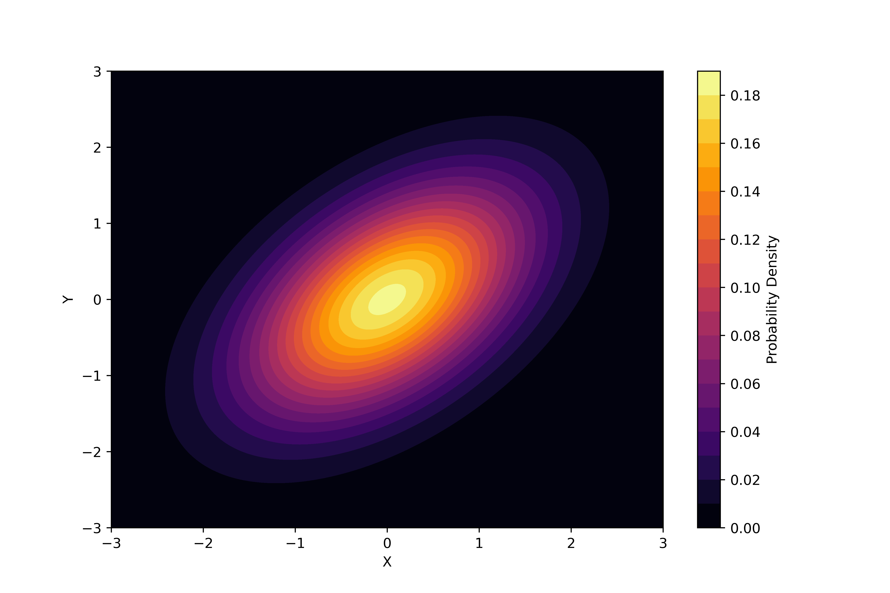
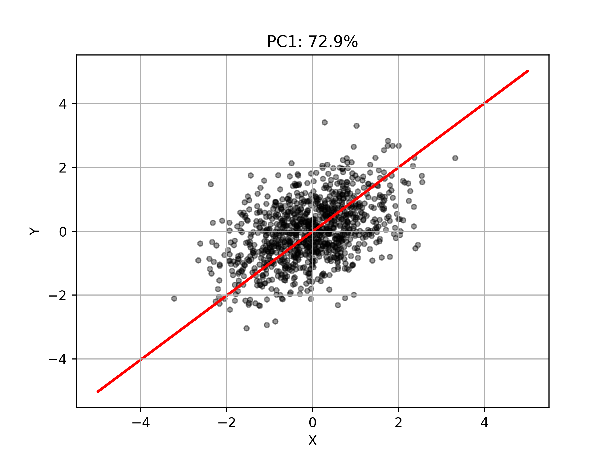

# General Data Analyses
Scripts for general data analyses (Laboratory purposes) and some algorithms for learning purposes

# Principal component analysis (R2)

[(Principal Component Analysis python scripts)](scripts/PCA.py)

Assume the presence of an arbitrary 2D Gaussian distribution within a two-dimensional space.

<div style="text-align: center;">
    
</div>

Let us sample 1,000 random points from this 2D Gaussian distribution.

<div style="text-align: center;">
    
</div>

Consider each point as a set of vectors in a two-dimensional space:

$$\mathbf{X} = 
\left(\begin{matrix}
x_1&\cdots&x_n \\
y_1&\cdots&y_n 
\end{matrix}\right)^\mathrm{T}\in \mathbb{R}^{n\times 2}$$


The covariance matrix for $\mathbf{X}$ is:

$$\Sigma =
 \begin{pmatrix} V[\mathbf{X_1}]&Cov[\mathbf{X_1},\mathbf{X_2}]
 \\ 
 Cov[\mathbf{X_1},\mathbf{X_2}]& V[\mathbf{X_2}] \end{pmatrix}\in \mathbb{R}^{2\times 2}$$


, where $\mathbf{X_1} = (x_1\:\cdots x_n)$, $\mathbf{X_2} = (y_1\:\cdots y_n)$.


Define a projection matrix for the linear transformation  $\mathbb{R}^2 \to \mathbb{R}$  as:

$$\mathbf{w} = \begin{pmatrix}w_1&w_2\end{pmatrix}^\mathrm{T}$$


The variance of the projected points onto $\mathbb{R}$ is given by:
$$s^2 = \mathbf{w}^\mathrm{T}\Sigma \mathbf{w}$$

We aim to maximize the variance such that the projected points correspond to the principal component.

To prevent the variance from diverging, we fix the norm of the projection matrix at 1. Therefore, we solve the following constrained maximization problem to find the projection axis:

$$arg \max (\mathbf{w}^\mathrm{T}\Sigma \mathbf{w}), \|\mathbf{w}\| = 1$$

To solve this maximization problem under the given constraint, we employ the method of Lagrange multipliers. This approach introduces an auxiliary function, known as the Lagrange function, to find the extremum of a function subject to constraints. The formulation of the Lagrange multipliers method applied to this problem is:

$$\cal{L}(\mathbf{w},\lambda) = \mathbf{w}^\mathrm{T}\Sigma \mathbf{w} - \lambda(\mathbf{w}^\mathrm{T}\mathbf{w}-1)$$

At the point of maximum variance:
$$\frac{\partial\cal{L}}{\partial{\mathbf{w}}} = 2\Sigma\mathbf{w}-2\lambda\mathbf{w} = 0$$

Hence, we find that:

$$ \Sigma\mathbf{w}=\lambda\mathbf{w} $$

Select the eigenvector corresponding to the largest eigenvalue (where $\lambda_1 > \lambda_2$) as the direction of the principal component.


<div style="text-align: center;">
    
</div>

# Singular Value Decomposition

## Singular Value

Consider the following three vectors:

$$\mathbf{A}\in\mathbb{R}^{m\times n}, \mathbf{v}\in\mathbb{R}^n,\mathbf{u}\in\mathbb{R}^m$$

Assume that the following equations hold true:

$$\mathbf{A}\mathbf{v}=\sigma \mathbf{u}$$
$$\mathbf{A}^\mathrm{T}\mathbf{u}=\sigma\mathbf{v}$$

Then, we can derive the following:

$$\mathbf{A}^\mathrm{T}\mathbf{A}\mathbf{v}=\sigma^2\mathbf{I}\mathbf{v}$$

We can solve this equation as follows:

$$|\mathbf{A}^\mathrm{T}\mathbf{A}\mathbf{v} - \sigma^2\mathbf{I}\mathbf{v}| = 0$$

Therefore, the singular value is described as:

$$\sqrt{\lambda}$$

where 

$$\det (\mathbf{B}-\lambda\mathbf{I})=0$$


# TODO 

RNA Seqの移植

最近説延期追放の移植


# Setup a python virtual environment 

1. Create a virtual environment for python3

```Bash
python3 -m venv venv
```
2. Activate the venv

```Bash
source venv/bin/activate
```
3. Leave the environment 

```Bash
deactivate
```

# Commands

## UPDATE requirements.txt

```Bash
pip freeze > requirements.txt
```

## INSTALL all the required modules

```Bash
pip install -r requirements.txt
```


