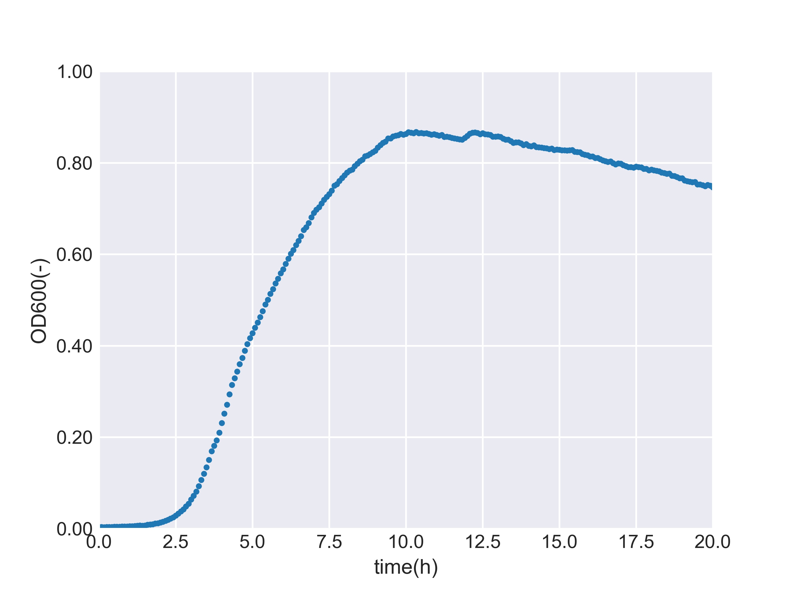
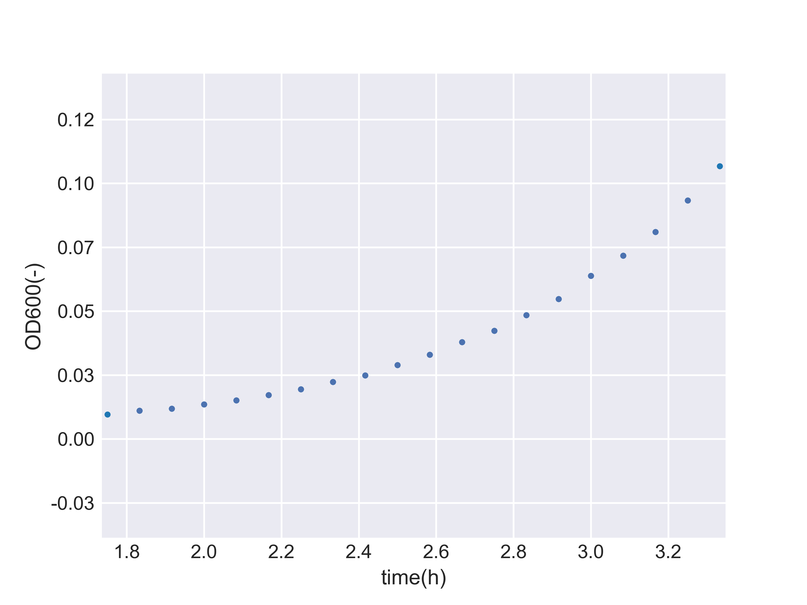
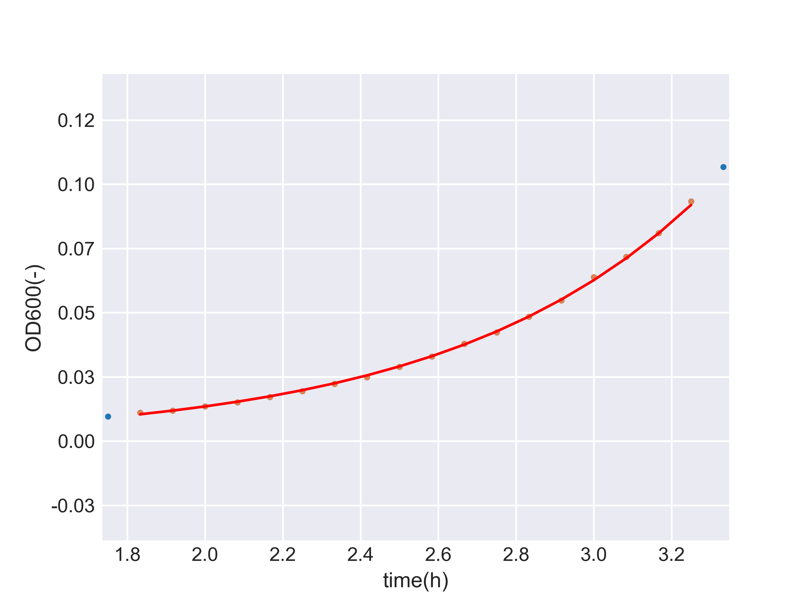

# General Data Analyses
Scripts for general data analyses (Laboratory purposes) and some algorithms for learning purposes

# Principal component analysis (R2)

[(Principal Component Analysis python scripts)](scripts/PCA.py)

Assume the presence of an arbitrary 2D Gaussian distribution within a two-dimensional space.

<div style="text-align: center;">
    
</div>

Let us sample 1,000 random points from this 2D Gaussian distribution.

<div style="text-align: center;">
    
</div>

Consider each point as a set of vectors in a two-dimensional space:

$$\mathbf{X} = 
\left(\begin{matrix}
x_1&\cdots&x_n \\
y_1&\cdots&y_n 
\end{matrix}\right)^\mathrm{T}\in \mathbb{R}^{n\times 2}$$


The covariance matrix for $\mathbf{X}$ is:

$$\Sigma =
 \begin{pmatrix} V[\mathbf{X_1}]&Cov[\mathbf{X_1},\mathbf{X_2}]
 \\ 
 Cov[\mathbf{X_1},\mathbf{X_2}]& V[\mathbf{X_2}] \end{pmatrix}\in \mathbb{R}^{2\times 2}$$


, where $\mathbf{X_1} = (x_1\:\cdots x_n)$, $\mathbf{X_2} = (y_1\:\cdots y_n)$.


Define a projection matrix for the linear transformation  $\mathbb{R}^2 \to \mathbb{R}$  as:

$$\mathbf{w} = \begin{pmatrix}w_1&w_2\end{pmatrix}^\mathrm{T}$$


The variance of the projected points onto $\mathbb{R}$ is given by:
$$s^2 = \mathbf{w}^\mathrm{T}\Sigma \mathbf{w}$$

We aim to maximize the variance such that the projected points correspond to the principal component.

To prevent the variance from diverging, we fix the norm of the projection matrix at 1. Therefore, we solve the following constrained maximization problem to find the projection axis:

$$arg \max (\mathbf{w}^\mathrm{T}\Sigma \mathbf{w}), \|\mathbf{w}\| = 1$$

To solve this maximization problem under the given constraint, we employ the method of Lagrange multipliers. This approach introduces an auxiliary function, known as the Lagrange function, to find the extremum of a function subject to constraints. The formulation of the Lagrange multipliers method applied to this problem is:

$$\cal{L}(\mathbf{w},\lambda) = \mathbf{w}^\mathrm{T}\Sigma \mathbf{w} - \lambda(\mathbf{w}^\mathrm{T}\mathbf{w}-1)$$

At the point of maximum variance:
$$\frac{\partial\cal{L}}{\partial{\mathbf{w}}} = 2\Sigma\mathbf{w}-2\lambda\mathbf{w} = 0$$

Hence, we find that:

$$ \Sigma\mathbf{w}=\lambda\mathbf{w} $$

Select the eigenvector corresponding to the largest eigenvalue (where $\lambda_1 > \lambda_2$) as the direction of the principal component.


<div style="text-align: center;">
    
</div>

# Singular Value Decomposition

## Singular Value

A singular value decompositon of $\mathbf{A}$ is written as:

$$\mathbf{A}=\mathbf{U}\mathbf{\Sigma}\mathbf{V}^\mathrm{T}$$

, where 

$$\mathbf{A}\in\mathbb{R}^{m\times n},\mathbf{U}\in\mathbb{R}^{m\times m},\mathbf{\Sigma}\in\mathbb{R}^{m\times n},\mathbf{V}\in\mathbb{R}^{n\times n}$$

Right Singular Vectors:

$$\mathbf{A}=\mathbf{U}\mathbf{\Sigma}\mathbf{V}^\mathrm{T}$$

$$\mathbf{A}^\mathrm{T}\mathbf{A}=(\mathbf{U}\mathbf{\Sigma}\mathbf{V}^\mathrm{T})^\mathrm{T}\mathbf{U}\mathbf{\Sigma}\mathbf{V}^\mathrm{T}$$

$$\mathbf{A}^\mathrm{T}\mathbf{A}= \mathbf{V}\Sigma^\mathrm{T}\mathbf{U}^\mathrm{T}\mathbf{U}\mathbf{\Sigma}\mathbf{V}^\mathrm{T}$$

thus 

$$\mathbf{A}^\mathrm{T}\mathbf{A}=\mathbf{V}\Sigma^2\mathbf{V}^\mathrm{T}$$

Right Singular Vectors:

$$\mathbf{A}\mathbf{A}^\mathrm{T}=\mathbf{U}\mathbf{\Sigma}\mathbf{V}^\mathrm{T}(\mathbf{U}\mathbf{\Sigma}\mathbf{V}^\mathrm{T})^\mathrm{T}$$

thus

$$\mathbf{A}\mathbf{A}^\mathrm{T}=\mathbf{U}\Sigma^2\mathbf{U}^\mathrm{T}$$


Hence, 

$$\mathbf{A}\mathbf{v}=\sigma \mathbf{u}$$
$$\mathbf{A}^\mathrm{T}\mathbf{u}=\sigma\mathbf{v}$$

Then, we can derive the following:

$$\mathbf{A}^\mathrm{T}\mathbf{A}\mathbf{v}=\sigma^2\mathbf{I}\mathbf{v}$$

We can solve this equation as follows:

$$|\mathbf{A}^\mathrm{T}\mathbf{A}\mathbf{v} - \sigma^2\mathbf{I}\mathbf{v}| = 0$$

Therefore, the singular value is described as:

$$\sqrt{\lambda}$$

where 

$$\det (\mathbf{B}-\lambda\mathbf{I})=0$$

## Dimentionality reduction with SVD

Assume that we have two series of data that describe expression patterns of stress response genes.

data1:

|    | rpoS | dnaK | oxyR | sosR | cspA |
|----|------|------|------|------|------|
| 0  | 0.61 | 0.16 | 0.08 | 0.05 | 0.10 |
| 1  | 0.54 | 0.18 | 0.07 | 0.10 | 0.12 |
| 2  | 0.57 | 0.10 | 0.06 | 0.15 | 0.12 |
| 3  | 0.39 | 0.16 | 0.17 | 0.13 | 0.15 |
| 4  | 0.45 | 0.14 | 0.18 | 0.14 | 0.08 |
| 5  | 0.42 | 0.08 | 0.12 | 0.19 | 0.19 |
| 6  | 0.50 | 0.17 | 0.05 | 0.16 | 0.11 |
| 7  | 0.44 | 0.16 | 0.08 | 0.18 | 0.15 |
| 8  | 0.51 | 0.12 | 0.23 | 0.05 | 0.09 |
| 9  | 0.59 | 0.04 | 0.12 | 0.05 | 0.20 |

data2:

|    | rpoS | dnaK | oxyR | sosR | cspA |
|----|------|------|------|------|------|
| 0  | 0.19 | 0.60 | 0.01 | 0.08 | 0.12 |
| 1  | 0.19 | 0.44 | 0.12 | 0.15 | 0.11 |
| 2  | 0.14 | 0.46 | 0.18 | 0.11 | 0.11 |
| 3  | 0.11 | 0.61 | 0.08 | 0.14 | 0.07 |
| 4  | 0.05 | 0.53 | 0.15 | 0.16 | 0.12 |
| 5  | 0.02 | 0.50 | 0.16 | 0.16 | 0.16 |
| 6  | 0.16 | 0.54 | 0.10 | 0.07 | 0.13 |
| 7  | 0.04 | 0.53 | 0.16 | 0.17 | 0.10 |
| 8  | 0.17 | 0.46 | 0.08 | 0.12 | 0.17 |
| 9  | 0.19 | 0.57 | 0.02 | 0.12 | 0.10 |


# Growth curve fitting 

The specific growth rate is a coefficient that represents how much one cell divides per unit of time.

Under constant conditions, with the cell mass denoted as X (g), the specific growth rate as μ ($\text{time}^{-1}$), and time as t($h$), the following equation holds:

$$\frac{dX}{dt}=\mu X$$

thus

$$\ln \frac{X}{X_0}=\mu t$$

where 

$X_0$ (g) is the initial cell mass.


Here, we calculate the specific growth rate ($\text{time}^{-1}$) of cells using the cell concentration (OD600) at each time point during the exponential growth phase.

Here is an example of sequential OD600 data of an <i>Escherichia coli</i> strain for 20 hours.

<div style="text-align: center;">
    
</div>

The exponential phase in this case is where OD600 is in between 0.01 and 0.10, therefore we only focus on the area.


<div style="text-align: center;">
    
</div>


Assume that the cell math icreases exponentially at the phase, we set a fitting model given by: 

$$X = e^{\mu t + \theta}$$

is also written as:

$$\ln X = \mu t + \theta$$

thus we use a normal equation: 

$$\begin{pmatrix}\mu&\theta \end{pmatrix} = (\mathbf{W}^\mathrm{T}\mathbf{W})^{-1} \mathbf{W}^\mathrm{T}\mathbf{f}\in \mathbb{R}^2$$

where 

$$\mathbf{f} = (\ln X_1\cdots \ln X_n)^\mathrm{T}\in \mathbb{R}^n$$

$$\mathbf{W}=\begin{pmatrix} 
    t_1&1&1\\ 
    \vdots &\vdots&\vdots\\ 
    t_n&1&1
\end{pmatrix}$$

With the model, we obtained the result where the specific growth rate is:

$$1.53 (\text{h}^{-1})$$

and the fitted growth curve is as shown below.

<div style="text-align: center;">
    
</div>


# Oligonucleotide Melting Temperature by Nearest Neighbors

In this section, we calculate Oligonucleotide Melting Temperature, denoted as Tm, with Nearest Neighbors method.

## Nearest Neighbors

With Nearest Neighbors method, Tm is calculated as:

$$T_{m} = \frac{\Delta H}{A + \Delta S + R\ln \frac{C}{4}} - 273.15+16.6\log[Na^{+}]$$

, where 

Tm = Melting temperature in ℃

$\Delta H$ = enthalpy change in $\frac{kcal}{mol}$

A = constant of -0.0108 $\frac{kcal}{K・mol}$

$\Delta S$  = entropy change in $\frac{kcal}{K・mol}$

R = gas constant of 0.00199 $\frac{kcal}{K・mol}$

C = oligonucleotide concentration in $M$ (as $mol/L$)

$[Na^{+}]$ = Sodium ion conc. in  $M$ (as $mol/L$)

and the parameters are already emprically determined as shown:

|  | $\Delta H$ | $\Delta S$|
|------|:--------:|:--------:|
| AA   | -9.1   | -0.024 |
| AT   | -8.6   | -0.0239|
| TA   | -6.0   | -0.0169|
| CA   | -5.8   | -0.0129|
| GT   | -6.5   | -0.0173|
| CT   | -7.8   | -0.0208|
| GA   | -5.6   | -0.0135|
| CG   | -11.9  | -0.0278|
| GC   | -11.1  | -0.0267|
| GG   | -11.0  | -0.0266|
| TT   | -9.1   | -0.024 |
| TG   | -5.8   | -0.0129|
| AC   | -6.5   | -0.0173|
| AG   | -7.8   | -0.0208|
| TC   | -5.6   | -0.0135|
| CC   | -11.0  | -0.0266|

# TODO 

RNA Seqの移植

最近説延期追放の移植

Micro plate reader 自動化


# Setup a python virtual environment 

1. Create a virtual environment for python3

```Bash
python3 -m venv venv
```
2. Activate the venv

```Bash
source venv/bin/activate
```
3. Leave the environment 

```Bash
deactivate
```

# Commands

## UPDATE requirements.txt

```Bash
pip freeze > requirements.txt
```

## INSTALL all the required modules

```Bash
pip install -r requirements.txt
```


