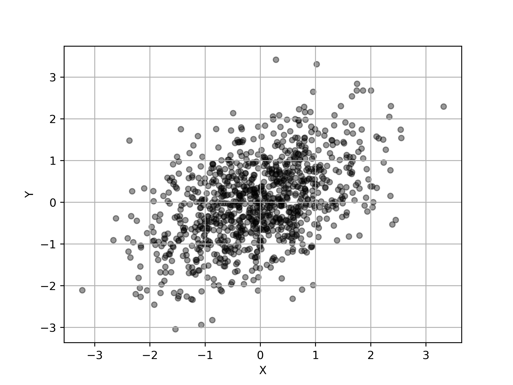

# General Data Analyses
Scripts for general data analyses (Laboratory purposes)

# Principal Component Analyses (R2)

[(Principal Component Analyses python scripts)](scripts/PCA.py)

Assume that we have an arbitrary 2d gaussian distribution in a two-dimentional space.


Let's sample 1000 random points from the 2d gaussian distribution space.



Consider each pont as a set of vectors in a two-dimensional space:

$$\mathbf{X} = 
\left(\begin{matrix}
x_1&\cdots&x_n \\
y_1&\cdots&y_n 
\end{matrix}\right)^\mathrm{T}\in \mathbb{R}^{n\times 2}$$


The covariance matrix for $\mathbf{X}$ is:

$$\Sigma =
 \begin{pmatrix} V[\mathbf{X_1}]&Cov[\mathbf{X_1},\mathbf{X_2}]
 \\ 
 Cov[\mathbf{X_1},\mathbf{X_2}]& V[\mathbf{X_2}] \end{pmatrix}\in \mathbb{R}^{2\times 2}$$


# Setup a python virtual environment 

1. Create a virtual environment for python3

```Bash
python3 -m venv venv
```
2. Activate the venv

```Bash
source venv/bin/activate
```
3. Leave the environment 

```Bash
deactivate
```

# Commands

## UPDATE requirements.txt

```Bash
pip freeze > requirements.txt
```

## INSTALL all the required modules

```Bash
pip install -r requirements.txt
```


